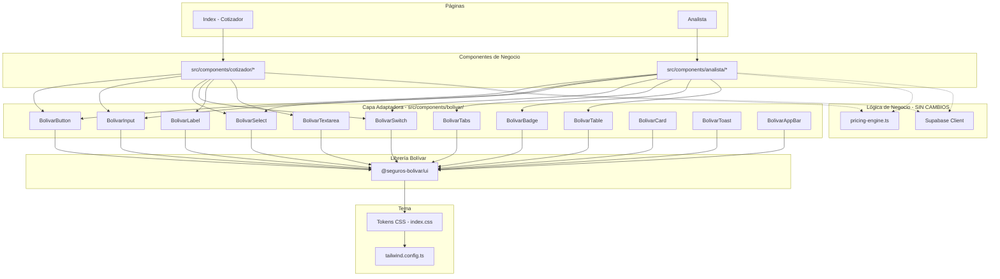
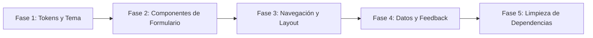

# Diseño Técnico — Integración Librería de Diseño Bolívar

## Resumen

Este documento describe la arquitectura y estrategia técnica para migrar el Cotizador de Vida Grupo Colectivo "726" desde componentes genéricos de shadcn/ui (Radix UI + Tailwind) hacia la librería de componentes oficial de Seguros Bolívar. La migración se realiza mediante una **capa adaptadora** (`src/components/bolivar/`) que mapea las interfaces actuales de shadcn/ui a los componentes de la Librería Bolívar, permitiendo una transición incremental sin romper funcionalidad existente.

### Hallazgos de Investigación

La librería de componentes de Seguros Bolívar es un paquete interno corporativo (asumido como `@seguros-bolivar/ui` o similar, distribuido vía registro npm privado o repositorio interno). Para el diseño se asume:

- La librería provee componentes React con TypeScript
- Incluye tokens de diseño (colores corporativos, tipografías, espaciados)
- Puede no cubrir el 100% de los componentes de shadcn/ui utilizados
- La documentación se obtiene del Storybook interno o repositorio de la librería

**Componentes shadcn/ui actualmente en uso** (identificados por análisis del código):

| Componente shadcn/ui | Usado en | Dependencia Radix |
|---|---|---|
| Button | Index, Analista, todos los steps | @radix-ui/react-slot |
| Input | StepGenerales, StepTomador, StepCoberturas, AnalystParams, AnalystCoverages | Ninguna |
| Label | Todos los formularios | @radix-ui/react-label |
| Select | StepGenerales, StepTomador | @radix-ui/react-select |
| Switch | StepCoberturas, AnalystCoverages | @radix-ui/react-switch |
| Tabs | Analista | @radix-ui/react-tabs |
| Badge | AnalystResults (potencial) | Ninguna |
| Toast/Toaster | App.tsx, Analista | @radix-ui/react-toast |
| Sonner | App.tsx | sonner |
| Tooltip | App.tsx | @radix-ui/react-tooltip |
| Card | Uso implícito vía clases CSS | Ninguna |
| Table | Uso implícito vía HTML nativo | Ninguna |

### Decisiones de Diseño

1. **Capa adaptadora sobre reemplazo directo**: Se crea `src/components/bolivar/` con wrappers que exponen la misma interfaz que shadcn/ui pero delegan al componente Bolívar internamente. Esto permite migración incremental y rollback fácil.

2. **Tokens CSS como puente**: Los tokens de diseño de Bolívar se mapean a las variables CSS existentes en `src/index.css`, minimizando cambios en componentes que usan clases Tailwind directamente.

3. **Motor de pricing intocable**: `src/lib/pricing-engine.ts` y sus interfaces TypeScript no se modifican. La migración es exclusivamente visual.

4. **Framer Motion condicional**: Se mantiene Framer Motion para animaciones de transición entre pasos si la Librería Bolívar no provee equivalente.

## Arquitectura

### Diagrama de Arquitectura



### Estrategia de Migración Incremental



**Fase 1**: Configurar tokens CSS y tipografías de Bolívar en `index.css` y `tailwind.config.ts`
**Fase 2**: Migrar Button, Input, Select, Switch, Label, Textarea via capa adaptadora
**Fase 3**: Migrar Tabs, StepIndicator, AppBar/Header
**Fase 4**: Migrar Table, Badge, Toast/Notification, Card
**Fase 5**: Eliminar dependencias @radix-ui/* no utilizadas y shadcn/ui residual

## Componentes e Interfaces

### Capa Adaptadora (`src/components/bolivar/`)

Cada adaptador expone la misma interfaz TypeScript que el componente shadcn/ui original, delegando internamente al componente de la Librería Bolívar.

#### Patrón General del Adaptador

```typescript
// src/components/bolivar/BolivarButton.tsx
import { BolivarButtonOriginal } from '@seguros-bolivar/ui';
import type { ButtonProps as ShadcnButtonProps } from '@/components/ui/button';

// Mapeo de variantes shadcn → Bolívar
const VARIANT_MAP = {
  default: 'primary',
  destructive: 'danger',
  outline: 'outlined',
  secondary: 'secondary',
  ghost: 'text',
  link: 'link',
} as const;

const SIZE_MAP = {
  default: 'medium',
  sm: 'small',
  lg: 'large',
  icon: 'icon',
} as const;

export const Button = forwardRef<HTMLButtonElement, ShadcnButtonProps>(
  ({ variant = 'default', size = 'default', className, ...props }, ref) => {
    return (
      <BolivarButtonOriginal
        ref={ref}
        variant={VARIANT_MAP[variant]}
        size={SIZE_MAP[size]}
        className={className}
        {...props}
      />
    );
  }
);
```

#### Índice de Adaptadores

```typescript
// src/components/bolivar/index.ts
export { Button } from './BolivarButton';
export { Input } from './BolivarInput';
export { Label } from './BolivarLabel';
export { Select, SelectTrigger, SelectContent, SelectItem, SelectValue } from './BolivarSelect';
export { Switch } from './BolivarSwitch';
export { Tabs, TabsList, TabsTrigger, TabsContent } from './BolivarTabs';
export { Textarea } from './BolivarTextarea';
export { Badge } from './BolivarBadge';
export { Table, TableHeader, TableBody, TableRow, TableHead, TableCell } from './BolivarTable';
export { Card, CardHeader, CardContent, CardFooter, CardTitle, CardDescription } from './BolivarCard';
export { toast, Toaster } from './BolivarToast';
export { AppBar } from './BolivarAppBar';
```

### Interfaces de los Adaptadores Principales

```typescript
// BolivarInput - misma interfaz que shadcn Input
interface BolivarInputProps extends React.ComponentProps<"input"> {
  // Sin cambios en la interfaz pública
}

// BolivarSelect - mapea la API compuesta de Radix Select
interface BolivarSelectProps {
  value?: string;
  onValueChange?: (value: string) => void;
  children: React.ReactNode;
}

// BolivarSwitch - mapea checked/onCheckedChange
interface BolivarSwitchProps {
  checked?: boolean;
  onCheckedChange?: (checked: boolean) => void;
  disabled?: boolean;
  className?: string;
}

// BolivarTabs - mapea la API compuesta de Radix Tabs
interface BolivarTabsProps {
  defaultValue?: string;
  value?: string;
  onValueChange?: (value: string) => void;
  children: React.ReactNode;
  className?: string;
}
```

### Componente AppBar (Header)

```typescript
// src/components/bolivar/BolivarAppBar.tsx
interface AppBarProps {
  title: string;
  subtitle?: string;
  icon?: React.ReactNode;
  actions?: React.ReactNode;
}
```

Reemplaza los headers custom de `Index.tsx` y `Analista.tsx` con el componente de navegación de la Librería Bolívar.

### Estrategia de Fallback

Para componentes sin equivalente en la Librería Bolívar:

```typescript
// src/components/bolivar/BolivarFallback.tsx
// Wrapper que aplica tokens Bolívar al componente shadcn/ui original
import { cn } from '@/lib/utils';

export function withBolivarTokens<P extends { className?: string }>(
  ShadcnComponent: React.ComponentType<P>,
  bolivarClasses: string
) {
  return forwardRef<any, P>((props, ref) => (
    <ShadcnComponent
      ref={ref}
      {...props}
      className={cn(bolivarClasses, props.className)}
    />
  ));
}
```

## Modelos de Datos

### Sin Cambios en Modelos de Datos

La migración es exclusivamente visual. Los siguientes modelos de datos permanecen **sin modificación**:

#### Motor de Pricing (src/lib/pricing-engine.ts)
- `PricingParams` — parámetros de cotización
- `CoverageConfig` — configuración de coberturas activas
- `CoverageDefinition` — catálogo de coberturas
- `CoverageResult` — resultado calculado por cobertura
- `QuoteResult` — resultado completo de cotización
- `COVERAGE_CATALOG` — catálogo estático de 14 coberturas
- `DEFAULT_PARAMS` — parámetros por defecto
- `calculateQuote()` — función principal de cálculo
- `formatCurrency()` / `formatRate()` — helpers de formato

#### Supabase (src/integrations/supabase/)
- Esquema de tabla `solicitudes` — sin cambios
- Cliente Supabase — sin cambios
- Tipos generados — sin cambios

#### Estado de Componentes
- `formData: Record<string, string>` en Index.tsx — sin cambios
- `Solicitud` interface en Analista.tsx — sin cambios
- Hooks `useToast` — se reemplaza la implementación pero se mantiene la interfaz

### Mapeo de Tokens de Diseño

```typescript
// Estructura del mapeo de tokens (en index.css)
interface BolivarTokenMap {
  // Colores corporativos Bolívar → variables CSS existentes
  '--primary': string;           // Verde Bolívar corporativo
  '--primary-foreground': string;
  '--secondary': string;         // Verde oscuro Bolívar
  '--accent': string;            // Dorado/Amarillo Bolívar
  '--background': string;
  '--foreground': string;
  '--muted': string;
  '--destructive': string;
  '--border': string;
  '--input': string;
  '--ring': string;
  '--radius': string;
  // Tokens adicionales de Bolívar
  '--success': string;
  '--step-active': string;
  '--step-completed': string;
  '--step-pending': string;
}

// Tipografías Bolívar → tailwind.config.ts
interface BolivarFontConfig {
  sans: string[];    // Fuente principal Bolívar (reemplaza Inter)
  display: string[]; // Fuente de títulos Bolívar (reemplaza Oswald)
}
```

### Mapeo de Componentes (Documento de Referencia)

| # | Componente shadcn/ui | Componente Bolívar Esperado | Archivos Afectados | Estrategia |
|---|---|---|---|---|
| 1 | Button | BolivarButton / BolButton | Index, Analista, Steps | Adaptador con mapeo de variantes |
| 2 | Input | BolivarInput / BolInput | StepGenerales, StepTomador, StepCoberturas, AnalystParams, AnalystCoverages | Adaptador directo |
| 3 | Label | BolivarLabel / BolLabel | Todos los formularios | Adaptador directo |
| 4 | Select (compuesto) | BolivarSelect / BolSelect | StepGenerales, StepTomador | Adaptador con mapeo de API compuesta |
| 5 | Switch | BolivarSwitch / BolToggle | StepCoberturas, AnalystCoverages | Adaptador con mapeo checked→value |
| 6 | Tabs (compuesto) | BolivarTabs / BolTabs | Analista | Adaptador con mapeo de API compuesta |
| 7 | Badge | BolivarBadge / BolTag | AnalystResults | Adaptador con mapeo de variantes |
| 8 | Toast/Sonner | BolivarToast / BolNotification | App.tsx, Analista | Adaptador de API imperativa |
| 9 | Tooltip | BolivarTooltip / BolTooltip | App.tsx | Adaptador directo |
| 10 | Card (implícito) | BolivarCard / BolCard | Múltiples | Adaptador o clases CSS |
| 11 | Table (implícito) | BolivarTable / BolTable | AnalystCoverages, AnalystResults | Adaptador de estructura |
| 12 | Textarea | BolivarTextarea / BolTextarea | StepClausulas, StepEnvio | Adaptador directo |


## Propiedades de Correctitud

*Una propiedad es una característica o comportamiento que debe mantenerse verdadero en todas las ejecuciones válidas de un sistema — esencialmente, una declaración formal sobre lo que el sistema debe hacer. Las propiedades sirven como puente entre especificaciones legibles por humanos y garantías de correctitud verificables por máquina.*

### Propiedad 1: Delegación de componentes adaptadores

*Para cualquier* componente adaptador (Input, Select, Switch, Label, Textarea, Tabs, Table, Badge, Card) y *para cualquier* conjunto de props válidas pasadas al adaptador, el adaptador debe renderizar el componente correspondiente de la Librería Bolívar con props equivalentes, y el componente shadcn/ui original no debe aparecer en el árbol de renderizado.

**Valida: Requerimientos 3.1, 3.2, 3.3, 3.4, 3.5, 4.1, 5.1, 5.2, 5.5, 5.6**

### Propiedad 2: Preservación del mapeo de variantes del Button

*Para cualquier* variante de Button de shadcn/ui (default, destructive, outline, secondary, ghost, link) y *para cualquier* tamaño (default, sm, lg, icon), el adaptador BolivarButton debe mapear la variante a su equivalente válido en la Librería Bolívar, y el botón renderizado debe ser funcional (clickeable, con el handler onClick invocado).

**Valida: Requerimiento 3.6**

### Propiedad 3: Wrapper de fallback aplica tokens Bolívar

*Para cualquier* componente shadcn/ui sin equivalente en la Librería Bolívar, el wrapper de fallback generado por `withBolivarTokens` debe aplicar las clases CSS de tokens Bolívar al componente, y las clases originales del componente deben preservarse (no sobreescribirse).

**Valida: Requerimiento 3.7**

### Propiedad 4: Delegación del sistema de notificaciones

*Para cualquier* invocación de toast/notificación con un mensaje y variante (default, destructive, success), el adaptador BolivarToast debe delegar al componente Notification de la Librería Bolívar con el mensaje y nivel de severidad equivalente.

**Valida: Requerimientos 5.3, 5.4**

### Propiedad 5: Invariancia de resultados del motor de pricing

*Para cualquier* combinación válida de PricingParams, CoverageConfig[], valorAseguradoBase (> 0), y numeroAsegurados (> 0), la función `calculateQuote` debe producir un QuoteResult con valores numéricos idénticos antes y después de la migración visual. Específicamente: `tasaCotizadaRedondeada`, `prima`, `comisionIva`, `gastos`, y `utilidad` deben ser exactamente iguales.

**Valida: Requerimientos 6.1, 6.2, 6.3, 6.4**

### Propiedad 6: Mapeo de coberturas de solicitud a CoverageConfig

*Para cualquier* solicitud con un array de coberturas (cada una con nombre y valor), la función de mapeo `handleSelect` debe producir un array de CoverageConfig[] donde cada cobertura mencionada en la solicitud tiene `active: true` y el `manualValue` parseado correctamente, y las coberturas no mencionadas mantienen su estado por defecto (excepto "muerte" que siempre es activa).

**Valida: Requerimiento 7.3**

### Propiedad 7: Estructura de datos de persistencia de solicitudes

*Para cualquier* conjunto de datos de formulario válido del Cotizador, el payload serializado para Supabase debe contener todos los campos requeridos por la tabla `solicitudes` con los mismos tipos de datos y estructura que la implementación pre-migración.

**Valida: Requerimiento 7.1**

### Propiedad 8: Preservación de navegación por teclado

*Para cualquier* secuencia de campos de formulario renderizados a través de adaptadores Bolívar, la navegación con Tab debe mover el foco al siguiente campo interactivo en orden del DOM, y Shift+Tab debe mover el foco al campo anterior, sin saltar ni atrapar el foco.

**Valida: Requerimientos 10.1, 10.2**

### Propiedad 9: Preservación de atributos ARIA en adaptadores

*Para cualquier* componente adaptador que renderiza un componente de la Librería Bolívar con atributos ARIA (aria-label, aria-describedby, role, etc.), el DOM resultante debe contener esos atributos ARIA sin modificación ni omisión por parte del adaptador.

**Valida: Requerimientos 10.3, 10.4**

## Manejo de Errores

### Errores de Componentes Faltantes

| Escenario | Estrategia |
|---|---|
| La Librería Bolívar no provee un componente equivalente | El adaptador usa `withBolivarTokens()` para envolver el componente shadcn/ui con tokens Bolívar |
| La Librería Bolívar cambia su API en una actualización | Los adaptadores aíslan el cambio; solo se actualiza el adaptador, no los consumidores |
| Un componente Bolívar falla en runtime | El adaptador puede implementar un error boundary que renderiza el componente shadcn/ui como fallback |

### Errores de Tema/Tokens

| Escenario | Estrategia |
|---|---|
| Variable CSS de Bolívar no definida | Las variables CSS en `index.css` definen valores por defecto que actúan como fallback |
| Tipografía Bolívar no cargada | `tailwind.config.ts` define fuentes de fallback del sistema (`sans-serif`) |
| Token de radio/sombra inválido | Se mantiene `--radius: 0.75rem` como valor por defecto |

### Errores de Integración Supabase

| Escenario | Estrategia |
|---|---|
| Error de conexión al enviar solicitud | Se muestra notificación de error usando `BolivarToast` con variante destructive |
| Error al cargar solicitudes en Analista | Se muestra mensaje de error en la UI con opción de reintentar |
| Datos de solicitud con formato inesperado | La función `handleSelect` maneja gracefully coberturas no reconocidas (las ignora) |

### Errores de Build/Dependencias

| Escenario | Estrategia |
|---|---|
| Dependencia @radix-ui eliminada prematuramente | Se verifica con `vite build` antes de hacer commit de la eliminación |
| Conflicto de versiones entre Librería Bolívar y Radix | Se usa la capa adaptadora para aislar; no se importan ambos en el mismo componente |
| Import circular entre adaptador y componente original | Estructura de carpetas separada (`bolivar/` vs `ui/`) previene ciclos |

## Estrategia de Testing

### Enfoque Dual: Tests Unitarios + Tests Basados en Propiedades

La estrategia de testing combina tests unitarios para verificar ejemplos específicos y casos borde, con tests basados en propiedades para verificar comportamientos universales.

### Librería de Property-Based Testing

Se utilizará **fast-check** (`fc`) como librería de property-based testing para TypeScript/JavaScript, integrada con **Vitest** (ya configurado en el proyecto).

```bash
npm install --save-dev fast-check
```

### Configuración de Tests de Propiedades

- Mínimo **100 iteraciones** por test de propiedad
- Cada test debe referenciar la propiedad del documento de diseño
- Formato de tag: `Feature: bolivar-library-integration, Property {N}: {título}`

### Tests Unitarios

Los tests unitarios cubren:

1. **Ejemplos específicos de configuración de tema** (Req 2.1-2.3): Verificar que variables CSS específicas están definidas con valores Bolívar
2. **Ejemplos de renderizado de headers** (Req 4.3-4.4): Verificar que AppBar se renderiza en Index y Analista
3. **Ejemplo de StepIndicator** (Req 4.2, 4.5): Verificar que usa componentes Bolívar o fallback con tokens
4. **Snapshot del catálogo de coberturas** (Req 6.3): Verificar que COVERAGE_CATALOG no ha cambiado
5. **Verificación de build** (Req 8.3): Verificar compilación exitosa post-migración
6. **Errores de Supabase** (Req 7.4-7.5): Verificar que errores muestran notificación Bolívar

### Tests Basados en Propiedades

| Propiedad | Generadores | Verificación |
|---|---|---|
| P1: Delegación de adaptadores | Generador de props válidas por tipo de componente | El componente Bolívar aparece en el render tree |
| P2: Mapeo de variantes Button | `fc.constantFrom('default','destructive','outline','secondary','ghost','link')` × `fc.constantFrom('default','sm','lg','icon')` | La variante mapeada es válida en Bolívar y el onClick se invoca |
| P3: Fallback con tokens | Generador de className strings | Las clases Bolívar y originales están presentes |
| P4: Delegación de toast | `fc.record({ message: fc.string(), variant: fc.constantFrom('default','destructive') })` | El componente Notification Bolívar recibe el mensaje |
| P5: Invariancia del pricing | `fc.record({ comision: fc.float({min:0,max:0.5}), utilidad: fc.float({min:0,max:0.5}), ... })` | QuoteResult idéntico pre/post migración |
| P6: Mapeo de coberturas | Generador de arrays de `{nombre, valor}` con nombres del catálogo | CoverageConfig[] correcto con active y manualValue |
| P7: Estructura de persistencia | Generador de formData con campos del cotizador | Payload contiene todos los campos requeridos |
| P8: Navegación por teclado | Generador de secuencias de campos de formulario | Tab mueve foco en orden, sin saltos |
| P9: Preservación ARIA | Generador de atributos ARIA comunes | Atributos presentes en DOM final |

### Estructura de Archivos de Test

```
src/test/
├── bolivar-adapters.test.tsx      # P1, P2, P3, P4: Tests de adaptadores
├── pricing-invariance.test.ts     # P5: Invariancia del motor de pricing
├── coverage-mapping.test.ts       # P6: Mapeo de coberturas
├── data-persistence.test.ts       # P7: Estructura de persistencia
├── accessibility.test.tsx         # P8, P9: Teclado y ARIA
├── theme-tokens.test.ts           # Tests unitarios de tema
└── setup.ts                       # Setup existente
```
